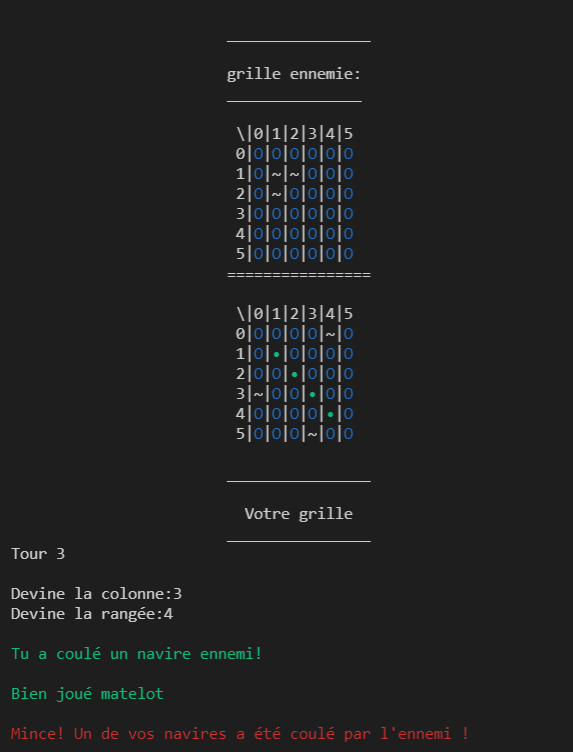
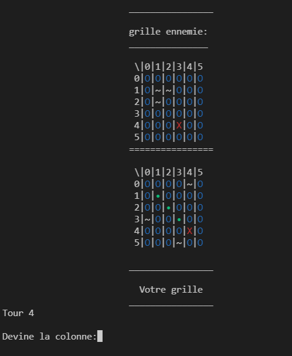

# Warship Game

Welcome to my warship game project 👋
This readme file contains a French and and English description.

Bienvenue sur le dépot de ma bataille navale 👋
Ce readme contient une description anglaise (ici) et française [(ici)](./french-readme/README.md)

# Summary 📄

- [Summary](#summary)
- [I. About this project](#About-this-project)
  - [1. Context](#Context)
  - [2. Special rules](#Some-special-rules)
    - [a/ The rules](#The-Rules)
- [II. Game overview](#overview)
- [III. Language used](#language-used)
  - [1. Python](#Python)

# About this project

## Context

This project was my very first "real" project in Python (which was my first coding language). 
I started it during my last year in high school and it was pretty... messy [(check the initial code)](./games/warship_v1.py).
This project made me enjoy Python and programming that's why I decided to make the code a little better over time.

## Some special rules

So, as I said, this game is the first one that i had to do so I had to modify the original game rules in order to make the game easier to code 😅

---

### The Rules:
- 1v1 against an AI
- Infinite mode or limited amount of a turns
- Small boats with a heigth and length of 1
- 6x6 grid (because of 1x1 boats the game easily gets boring with 10x10 grid and is too fast with 5x5)
- The player has to place 4 boats
- Game ends when there is no more turn or every player's or AI's boat are destroyed

# Overview

### Here are some screenshots of the game:
``Attacks announcement:``

---

``Next round, the grid updated with the destroyed boats:``

# Language used

## Python

This project is made out of Python language and contains basic functions and imports since this is a beginner project.
I hope that the code may help you, have fun with it !